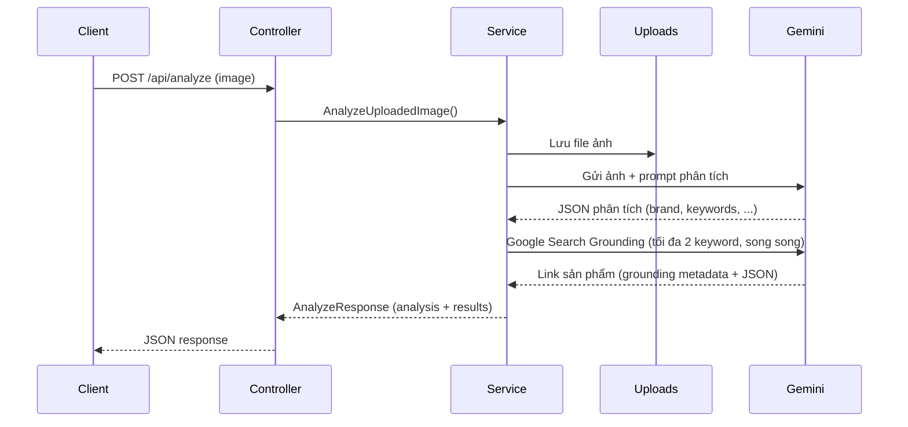

# GO_LUXURY - Phân tích sản phẩm thời trang xa xỉ bằng AI

API Go nhận ảnh sản phẩm thời trang, lưu vào thư mục `uploads/`, gửi Gemini phân tích và trả về JSON mô tả sản phẩm.

## Yêu cầu

- Go 1.25+
- API key Gemini (`GEMINI_API_KEY`)

## Cài đặt

```bash
# Clone và vào thư mục dự án
cd GO_LUXURY

# Tạo file .env
echo "GEMINI_API_KEY=your_api_key_here" > .env

# Cài dependency và build
go mod tidy
go build -o bin/server .
```

## Chạy server

```bash
go run .
# hoặc
./bin/server
```

Server mặc định chạy tại `http://localhost:8080`. Có thể đổi port bằng biến môi trường `PORT`.

## API

### `POST /api/analyze`

Upload ảnh và nhận kết quả phân tích từ Gemini.

**Request:** `multipart/form-data` với field `image`

```bash
curl -X POST http://localhost:8080/api/analyze \
  -F "image=@/path/to/your-image.jpg"
```

**Response (200):**

```json
{
  "analysis": {
    "brand": "Gucci",
    "model": "Dionysus",
    "color": "black",
    "material": "leather",
    "category": "handbag",
    "search_keywords": ["gucci dionysus", "black leather bag"],
    "similar_style_keywords": ["chain shoulder bag", "luxury crossbody"]
  },
  "results": [
    {
      "site": "www.farfetch.com",
      "keyword_used": "gucci dionysus",
      "product_url": "https://www.farfetch.com/shopping/women/..."
    }
  ]
}
```

Sau khi phân tích ảnh, API dùng **Google Search Grounding** để tìm sản phẩm: tối đa **2 keyword** quan trọng nhất (ưu tiên `search_keywords`, sau đó `similar_style_keywords`), chạy **song song**, mỗi keyword trả tối đa **5 URL** sản phẩm.

Log thời gian từng bước xuất ra console server với prefix `[timing]` (upload, phân tích ảnh, từng keyword search, tổng request).

### `GET /health`

Kiểm tra server còn hoạt động.

## Luồng xử lý



## Cấu trúc thư mục

```
GO_LUXURY/
├── controllers/     # Parse request, gọi service, trả response
├── routes/          # Cấu hình route HTTP (ví dụ /api/analyze, /health)
├── services/        # Business logic (upload, gọi Gemini)
├── models/          # Struct dữ liệu
├── uploads/         # Ảnh đã upload
├── main.go          # Khởi tạo dependency và chạy server
└── .env             # GEMINI_API_KEY
```
